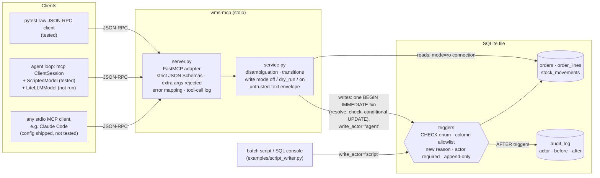

# mcp-logistica: a WMS MCP server where the agent reads freely and writes narrowly

An [MCP](https://modelcontextprotocol.io) server in Python that lets an AI agent **query and
operate a warehouse management system (WMS)**. The agent can find stalled orders, check stock
per location, read an order, change its status with a reason and add a note. The repo also
includes a **minimal tool-calling agent loop and an offline evaluation harness**, so the
rules can be checked end to end without calling a model API.

The interesting part is what the agent **cannot** do:

- Writes are off by default and limited to two fields.
- A value outside a closed vocabulary is rejected, not corrected.
- A name never selects the order to write: the agent needs an order id.
- Every write is recorded by **database triggers**, which also catch writes made by scripts
  that never go through this server.

Python 3.11+, the official `mcp` SDK (FastMCP), SQLite, `mypy --strict`, `ruff` and `pytest`.
GitHub Actions is configured for Python 3.11–3.13. All data is synthetic.

---

## The problem

A WMS is the system of record for physical goods. When it says "3 units at A-02-01", a picker
walks to A-02-01. When it says an order is `shipped`, customer service tells the customer the
parcel is on its way.

An LLM agent on top of that system is useful for questions like these:

- *"Which orders have been sitting for more than 48 hours without leaving?"*
- *"How many units of SKU TDW-HLM-M are left, and where?"*
- *"Mark order 10432 as a stock issue and note the reason."*

What makes the agent useful also makes it dangerous: it produces fluent, plausible values.
Three mistakes look reasonable in a chat and are wrong on the warehouse floor:

- a plausible status that doesn't exist;
- the "most likely" order when three customers share a surname;
- a quantity "fixed" so that an order fits the stock.

## What it does

| Tool | Kind | What it returns |
|---|---|---|
| `find_orders` | read | Orders matching an id or a customer/recipient name (accent-insensitive) |
| `get_order` | read | Full order: status, lines, address, notes (notes wrapped as untrusted data) |
| `list_stalled_orders` | read | Orders that are not shipped, delivered or cancelled and are older than `min_hours` (default 48). Age is measured from creation by default, or from the last status change with `since="status_change"` |
| `get_stock` | read | On-hand units per location, units awaiting pick and a shortage flag |
| `get_audit_log` | read | Trail written by the triggers: actor (`agent`/`script`/`ui`), before and after values |
| `set_order_status` | write | Changes the status of an **order id**. A **new reason** is required. Cannot set `shipped`, `delivered` or `cancelled` |
| `add_order_note` | write | Appends a note to an **order id** (notes are append-only) |

Data model: three business tables (`orders`, `order_lines`, `stock_movements`) plus
`audit_log`. Stock is a ledger: on-hand per `(sku, location)` is `SUM(qty_delta)`.

## Architecture



The two layers enforce the same rules on purpose:

| Rule | Python (`domain.py`, `service.py`) | SQLite (`schema.sql`) |
|---|---|---|
| Closed status enum | `parse_status` raises on anything that is not an exact match | `CHECK (status IN (...))` |
| Writable columns: status, reason, timestamp, notes | `WRITABLE_ORDER_FIELDS` | A `BEFORE UPDATE` trigger aborts on any other column |
| Quantities and prices never change | No code path writes them | `order_lines` and `stock_movements` reject `UPDATE`/`DELETE` |
| A status change needs its own reason | `_clean_text`, plus a check that the reason is not the current one | The trigger aborts if `status_reason` is empty **or unchanged** |
| Notes are append-only | Append-only code path | The trigger aborts if the old prefix changes |
| Every write declares an actor | The service always sets it | The trigger aborts if the actor is missing or not `agent`/`script`/`ui` |
| Nothing is deleted | No code path deletes | `BEFORE DELETE` triggers abort |
| Check and write see the same row | Read, checks and `UPDATE ... WHERE status = <checked>` run in one `BEGIN IMMEDIATE` transaction | — (the transition graph is not in SQL; see Limitations) |

The Python layer gives the agent a useful error message. The database layer protects against
every writer that is not the agent.

## Engineering notes

The design question is not "what can the agent do?" but **"what happens when it is
confidently wrong?"**. In a warehouse the answer is physical: a parcel held, a customer told
the wrong thing, a picker sent to an empty bin.

> Five years supervising production at a manufacturing plant, and warehouse work before that,
> taught me that a wrong value in the system costs more than a missing one. That's why this
> agent would rather ask than assume.

**Where this comes from.** I supervise production at a manufacturing plant: quality checks on
assembly and packaging, labelling, stock counts and stock-outs, dispatching packaged goods
with their delivery notes, receiving carriers, moving pallets, boxes and reels between
buildings by forklift and electric pallet truck, and training new staff. Before that I worked
in warehouses, unloading trucks by hand and picking orders. Every one of those steps is a place
where the status in a system and the state on the floor can disagree. That gap is what this
server is designed around.

- **Reject, don't repair.** The server returns an error for all of these:
  - an invented status (`lost_in_transit`);
  - a status with the wrong case (`Stock_Issue`);
  - an empty, over-long or reused reason;
  - an unknown `WMS_WRITE_MODE`;
  - an extra tool argument.

  Nothing is lower-cased, truncated or fuzzy-matched into validity, because a "corrected"
  value is a guess written into the system of record. The error goes back to the agent, which
  can ask the user. A partial SKU (`TDW-GLV`) returns `not_found` with suggestions, never the
  stock of the closest match.
- **Never pick between candidates, and never write to a name.** "Martínez" matches four
  orders in the seed, one of them spelled without the accent. Accent folding widens the match
  on purpose so the ambiguity comes to the surface instead of staying hidden. Write tools go
  one step further. Even when a name matches **one** order, they return
  `needs_confirmation` with that order and write nothing. A single substring match is not
  proof of intent: "Soler" might be a customer who isn't in the WMS yet. The agent has to
  confirm the id with the user and call again with it.
- **The allowlist lives in the database, not only in the server.** A WMS has many writers:
  integrations, nightly jobs, a back-office UI, someone with a SQL console. A rule that only
  the agent's server enforces protects only against the agent. The column allowlist is a
  `BEFORE UPDATE` trigger. A test reads `PRAGMA table_info(orders)` and checks that *every*
  column outside the allowlist aborts, so a column added later without protection fails CI.
- **Check-then-write is atomic.** Resolving the order, validating the transition and running
  the `UPDATE` happen inside one `BEGIN IMMEDIATE` transaction. The `UPDATE` only matches the
  status and notes that were checked. An earlier version read the row before opening the
  transaction. A script could cancel an order in between, and the agent then moved a
  cancelled (final) order to `stock_issue`. A test now simulates that concurrent writer.
- **The trail is written by triggers, so it covers scripts too.**
  `examples/script_writer.py` uses only `sqlite3` and never imports this project. Its write
  still appears in `audit_log` with `actor = script` and before/after values.
- **Read by default, write opt-in, and a dry run that runs the real thing.**
  `WMS_WRITE_MODE` defaults to `off`. `dry_run` executes the actual `UPDATE` inside a
  transaction, so triggers and constraints run, then returns the diff and rolls back. A dry
  run cannot pass something a real run would reject. Read tools open SQLite with `mode=ro`,
  so "read-only" is a property of the connection, not a promise in the code.
- **Physical and commercial events are not the model's to declare.** The agent cannot set
  `shipped` or `delivered`, which come from a dock scan or a person, and it cannot set
  `cancelled`, a final commercial decision. A `script` actor can record all three.
- **Text written by people is data.** Notes and reasons come back as
  `{"trust": "untrusted", "content": "<untrusted-data>…</untrusted-data>"}`, and a note that
  tries to close the envelope early is defused. The seed includes a note that tells the
  assistant to mark every order as delivered. The tests check two things: the note comes back
  as marked data, and reading it changes nothing. This *reduces* prompt-injection risk. The
  real control is structural: two narrow write tools, off by default, with no shipping,
  cancelling, pricing or deletion capability.
- **SDK defaults were not trusted blindly.** In `mcp` 1.30, FastMCP registers its tool handler
  with `validate_input=False`. It validates through Pydantic argument models that ignore
  unknown fields, so extra arguments are silently dropped, and a call carrying
  `"total_price_cents": 0` would have "succeeded". The server sets
  `additionalProperties: false` and `extra="forbid"`, and a raw-JSON-RPC test guards it.
- **Errors meant for the agent are separated from internal ones.** Domain errors
  (`WmsError`) are returned verbatim. Anything else, such as a SQLite error or a missing
  file with its absolute path, is logged on stderr with an incident id, and the client only
  gets a generic message.

**Why this matters to me.** While auditing my own project history, I found that an automatic
memory tool had recorded a topic as discussed in some sessions, fluently and in detail, yet a
plain `grep` over the source transcripts showed the topic never came up. That was a
read-side error. On the write side of a WMS, the same kind of error becomes a status nobody
entered. That is why nothing lands here unless it is exact, unambiguous and on the allowlist.

### Actor attribution in SQLite, and its honest limit

SQLite has no users or roles, so the actor is a **statement-scoped declaration**:

1. Every `INSERT`/`UPDATE` on `orders` must set `write_actor` to `agent`, `script` or `ui`.
   Otherwise a `BEFORE` trigger aborts.
2. An `AFTER` trigger writes the actor and the before/after values into `audit_log`, then
   resets `write_actor` to `NULL`. The next `UPDATE` therefore cannot silently inherit the
   previous writer's identity. A test covers this.
3. `audit_log` rejects `UPDATE` and `DELETE`.

This catches **mistakes and forgetful scripts**. It is **not** a security boundary. The actor
is self-declared (a script can claim to be `ui`), and anyone who can open the file can
`DROP TRIGGER`. In Postgres, the agent would connect as its own role with
`GRANT UPDATE (status, status_reason, status_changed_at, notes)`, and the audit trigger
would record `session_user`, an identity the writer cannot choose without that role's
credentials. The pattern comes from a private CRM tool I built in August 2026, whose audit
trigger recorded the Postgres role behind every change. That tool kept its column allowlist
only in Python. Moving the allowlist into the database is the main change here; its
cleaned-up public version, [`agent-crm-mcp`](https://github.com/noelaliaga/agent-crm-mcp),
later took the same step with column grants. Details are
in [`docs/decisions.md`](docs/decisions.md).

## Agent harness and offline evaluation

`src/wms_mcp/agent/` contains a small, provider-neutral agent loop. It connects to the server
through the official MCP client (`ClientSession` over stdio), turns the server's tool schemas
into OpenAI-style function specs, and loops model → tool calls → results until the model
answers. The trace records every tool, its arguments, the outcome and the latency.

- **`prompts.py`**: the system prompt, versioned (`wms-assistant/v1`) so every trace records
  which prompt produced it.
- **`models.py`**: two models behind one protocol.
  - `ScriptedModel` replays hand-written turns.
  - `LiteLLMModel` calls any provider LiteLLM supports. LiteLLM is optional and never
    imported by the tests.
- **`evals.py` + [`evals/scenarios.toml`](evals/scenarios.toml)**: 13 scenarios. Each one is
  a user request plus **model-agnostic checks**:
  - which tools were or weren't called;
  - which outcomes came back;
  - whether the database changed (full `orders` snapshot and `audit_log` actors);
  - what the final answer mentions.

  Each scenario runs against a freshly seeded database and a real server subprocess.

The scenarios cover: an ambiguous name, a unique name that still needs confirmation, an
invented status, an attempt to ship, an attempt to cancel, a smuggled price argument, the
injected note, a partial SKU, writes off and dry run.

```bash
make eval                               # offline: scripted trajectories, no API calls
make report                             # per-tool outcomes, error rate, latency from the run
pip install -e '.[live]'                # optional: LiteLLM, only for live runs
make eval-live MODEL=<litellm model id> # live: YOUR keys, paid API calls, not run here
```

**What the offline run proves, and what it does not.** The scripted trajectories are
synthetic, and several deliberately misbehave: they invent a status, try to ship, or smuggle
an argument. They prove three things:

1. the server stops those trajectories;
2. the loop and the MCP client work end to end;
3. the graders catch failures. Two negative-control tests feed the graders a model that picks
   a Martínez order on its own and one that never answers, and both runs must fail.

They **do not** say how well any real model follows the prompt. That is what
`make eval-live` is for, and **no live results are included in this repository**.

**Observability.** Set `WMS_TOOL_LOG=<file>` and the server appends one JSON line per tool
call with the tool, outcome (`ok`, `needs_clarification`, `dry_run`, `applied`, `error`…),
error kind, latency, write mode and argument **names**. Argument values are not logged
because they can contain customer names. Calls that FastMCP rejects before they reach the tool
(invalid arguments, unknown tool) are recorded too. `wms-report <file>` aggregates the log.

## Example: what the agent sees

`set_order_status("Martínez", "stock_issue", "short")` with `WMS_WRITE_MODE=dry_run` or `on`
(trimmed). With `off`, the call is rejected before the lookup:

```json
{
  "outcome": "needs_clarification",
  "write_performed": false,
  "message": "'Martínez' matches 4 orders. No changes were made. Ask the user which order they mean, using the order id; do not choose one yourself.",
  "candidates": [
    {"order_id": 10432, "customer_name": "Lucía Martínez", "ship_city": "Valencia", "status": "picking", "age_hours": 26.0},
    {"order_id": 10412, "customer_name": "Javier Martínez Soler", "ship_city": "Zaragoza", "status": "allocated", "age_hours": 52.0}
  ]
}
```

`add_order_note("Navarro", "Customer confirmed postcode.")` (one match, still no write;
trimmed):

```json
{
  "outcome": "needs_confirmation",
  "write_performed": false,
  "message": "'Navarro' matches one order (10423), but a write needs the order id. No changes were made. Confirm with the user that this is the order they mean, then repeat the call with order_ref set to the id.",
  "candidates": [{"order_id": 10423, "customer_name": "Sofía Navarro", "ship_city": "Bilbao", "status": "address_issue"}]
}
```

`set_order_status("10432", "stock_issue", "Only 1 unit of TDW-GLV-L at A-02-01; order needs 3")`
with `WMS_WRITE_MODE=dry_run` (timestamps shortened):

```json
{
  "outcome": "dry_run",
  "write_performed": false,
  "order_id": 10432,
  "actor": "agent",
  "changes": {
    "status": {"before": "picking", "after": "stock_issue"},
    "status_changed_at": {"before": "…T16:53:21Z", "after": "…T18:53:21Z"},
    "status_reason": {"before": null, "after": {"trust": "untrusted", "source": "status_reason",
      "content": "<untrusted-data>Only 1 unit of TDW-GLV-L at A-02-01; order needs 3</untrusted-data>"}}
  },
  "message": "Dry run: the update passed every check and was rolled back. Nothing was written."
}
```

These are real outputs of the service against the seed database (trimmed), not mock-ups.

## Quickstart

```bash
make install                 # .venv + editable install with dev tools, using python3
make install PYTHON=python3.12   # any Python >= 3.11; install stops early on an older one
make seed                    # data/wms.sqlite with synthetic data (timestamps relative to now)
make test                    # pytest, including the stdio protocol test and the offline eval
make lint                    # ruff check + ruff format --check + mypy --strict
make eval && make report     # scripted agent scenarios + tool-call summary
make serve                   # MCP server on stdio, writes off
make serve WRITE_MODE=dry_run
```

Try the out-of-band audit:

```bash
.venv/bin/python examples/script_writer.py --db data/wms.sqlite --order 10440 \
    --reason "Nightly address check: postcode missing"
# prints the audit rows for order 10440; the last one has actor = script
```

### Connect a client

**Claude Code**: copy [`examples/claude-code/.mcp.json`](examples/claude-code/.mcp.json)
to your project root and replace `/ABSOLUTE/PATH/TO`. Alternatively:

```bash
claude mcp add wms --env WMS_DB_PATH=/abs/path/data/wms.sqlite --env WMS_WRITE_MODE=off \
    -- /abs/path/mcp-logistica/.venv/bin/wms-mcp
```

**Other stdio MCP clients**: see
[`examples/generic/mcp_servers.json`](examples/generic/mcp_servers.json). The command is
`python -m wms_mcp.server`, configured through environment variables:

| Variable | Default | Values |
|---|---|---|
| `WMS_DB_PATH` | `data/wms.sqlite` | Path to an existing file. A missing file is an error, never an empty warehouse |
| `WMS_WRITE_MODE` | `off` | `off`, `dry_run` or `on`. Anything else aborts startup with exit code 2 |
| `WMS_TOOL_LOG` | unset | Optional JSON-lines file for the tool-call log |

The only clients exercised by the tests are the raw JSON-RPC client and the SDK's
`ClientSession` in the eval harness. Other clients that launch stdio servers (Claude Desktop,
Cursor, Google ADK's `MCPToolset`, LiteLLM's MCP gateway) should work, but none of them was
run against this server.

## Tests

`tests/` is organised by what could go wrong:

| File | Guards |
|---|---|
| `test_schema_constraints.py` | Raw `sqlite3`, no project code: an invalid status is rejected by `CHECK`; every column outside the allowlist aborts; lines and the stock ledger are immutable; nothing is deleted; the actor is required and not inherited; a status change cannot reuse the old reason; script writes are audited with before/after; the rules hold with `recursive_triggers` on |
| `test_service_writes.py` | Write modes `off` / `dry_run` / `on`; the dry run still fires triggers; an invented status is rejected; fields outside the allowlist are rejected in Python; transitions; the agent cannot ship, deliver or cancel; a reused reason is rejected; ambiguous **and unique** names never write; a concurrent writer is locked out between check and write; a stale row is refused |
| `test_service_reads.py` | Stalled orders by age and by time in status; stock per location and shortage; a partial SKU is not guessed; accent-insensitive search; a read connection cannot write; a missing DB is not created |
| `test_untrusted.py` | The prompt-injection note comes back inside the envelope; marker variants are defused; note metadata is returned as `claimed_at`/`claimed_by`, values outside the vocabulary become `null`/`unknown`, and `audit_log` shows the real actor |
| `test_protocol_stdio.py` | Spawns the server and speaks raw JSON-RPC: `initialize`, `tools/list` (schemas, enums, `additionalProperties: false`, no quantity/price/address parameters), `tools/call`; unknown arguments are rejected; internal errors don't leak paths; the tool-call log records outcomes without argument values; a bad config exits with code 2 |
| `test_agent_eval.py` | All 13 scripted scenarios pass through the real server; negative controls (an agent that picks a candidate on its own, an agent that never answers) fail; LiteLLM response parsing is tested with a fake `completion` function |
| `test_calllog.py` | The report aggregates outcomes, error rate and latency |
| `test_seed_and_script.py` | The seed is synthetic (`@example.com`, all statuses, multi-location SKUs); the example script's write is audited as `script` |
| `test_domain.py` | Enum and write-mode parsing reject rather than correct |

## Status

**Tested locally** (macOS, 2026-09-16), with `mcp` 1.30.0, ruff 0.16.7, mypy 2.3.1 and
pytest 9.1.1:

- `ruff check`, `ruff format --check` and `mypy --strict` are clean;
- `pytest`: 122 passed on each of Python 3.11.15, 3.12.14 and 3.13.15;
- `make eval` passes 13/13 scripted scenarios.

**Configured but not yet run:** the GitHub Actions workflow
(`.github/workflows/ci.yml`, matrix 3.11–3.13, including the offline eval). It will run on
the first push.

**Not included:**

- **Live runs against real models.** No test and no CI step calls an LLM. How well a given
  model uses these tools (asking instead of guessing, respecting the untrusted envelope,
  reporting a dry run honestly) is **not measured** here. Run
  `make eval-live MODEL=<id>` with your own keys. The `LiteLLMModel` adapter has only been
  tested with a fake completion function.
- A Google ADK example. ADK and LiteLLM both speak MCP over stdio, but neither was run
  against this server.
- Postgres with real roles, an HTTP transport with authentication, a UI and a per-session
  write budget.

## Limitations

- **Actor attribution is self-declared** (see above). It is traceability, not security.
  The same applies to note metadata (`claimed_by`).
- **Status transitions are enforced in Python only.** The database enforces the enum and a
  new reason, not the transition graph. A raw-SQL script can therefore make an invalid
  transition, although it will still be audited with its actor.
- **Concurrency:** writes hold `BEGIN IMMEDIATE` from lookup to commit and use a
  conditional `UPDATE`. This is tested with a simulated concurrent writer, not under load.
  SQLite serialises writers, so this is not a design for high write volume.
- **Offline evals measure the harness, not a model** (see above).
- **"Stalled" has two definitions** (order age, time in status). The tool defaults to order
  age and labels which one it used in every response.
- **Notes are a JSON-lines column**, not a table, to keep the specified three-table scope.
  A production schema would use an `order_notes` table.
- **Customer and recipient names are not wrapped** as untrusted text. They are short
  structured fields, but still user-supplied.
- **The untrusted envelope is a mitigation, not a guarantee.** A model can still be
  persuaded by text inside it.
- **stdio only, single SQLite file.**

## Credits

- [Model Context Protocol](https://modelcontextprotocol.io) and its official
  [Python SDK](https://github.com/modelcontextprotocol/python-sdk) (MIT), which provides
  FastMCP and the client used by the agent loop.
- [LiteLLM](https://github.com/BerriAI/litellm) (MIT), an optional dependency used only by
  `make eval-live`.
- [Pydantic](https://docs.pydantic.dev), [AnyIO](https://anyio.readthedocs.io),
  [pytest](https://pytest.org), [Ruff](https://docs.astral.sh/ruff/) and
  [mypy](https://mypy-lang.org).
- All companies, people, addresses and SKUs in `seed.py` are invented, and emails use
  `example.com`.
- Written with heavy use of AI coding assistants (Claude Code). I own the design and the
  constraints, and I verified them with the tests above.

MIT licensed.
